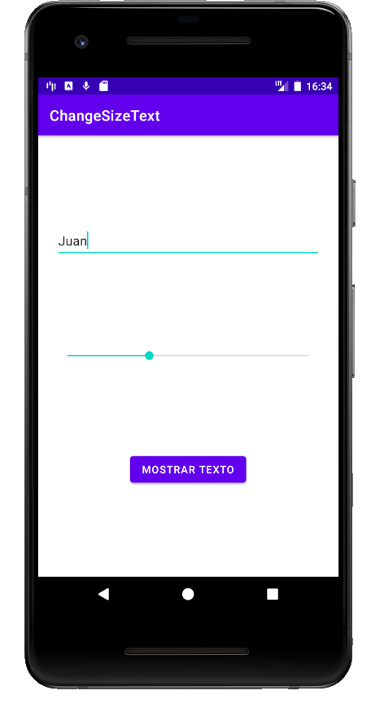
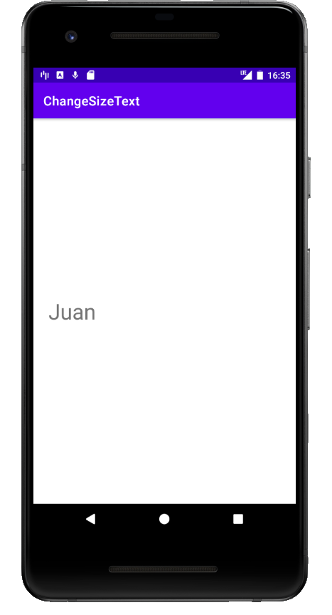

# ChangeSizeText 
En este Proyecto hemos realizado una aplicación que indicando un Texto en el campo `EditText` podremos modificar su tamaño mediante una `SeekBar` y para mostrar los cambios en otra `Activity` utilizamos un `Button`.

Una  vez que hemos introducido el texto, hemos seleccionado el tamaño y hemos pulsado sobre el `Button` (Comprobar Texto), se nos abrira una `Activity` en la que mostrara en un `TextView` el texto introducido con el tamaño de letra proporcionado.

# Cosas a tener en cuenta
* En este Proyecto hemos incluido el POJO `User` dentro de otro POJO llamado `Message`.
* Nuestro POJO `User` es compartido por todas las `Activity` ya que lo iniciamos en una clase que hemos creado que hereda de `Application`.
* Para hacer que funcione bien la nueva clase que hereda de `Application` hay que cambiar el `manifiest` el `android:name` de `Application`.
* Nuestro `Message` es declarado en la `Activity` ConfigSizeTextActivity y es rellenado con el User Compartido, el Progress del `SeekBar` y el texto del `EditText`. Es transportado a traves de un `Bundle` con el `intent` que se comunica con la `Activity` ViewActivity.
* Ya en ViewActivity se saca el objeto serializado del `Bundle` y se pone el Texto del `Message` en el `TextView` con el tamaño seleccionado por el Usuario.    

# Imagenes De La Aplicación

